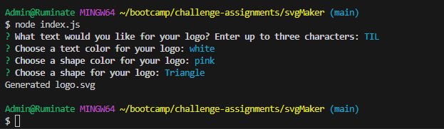
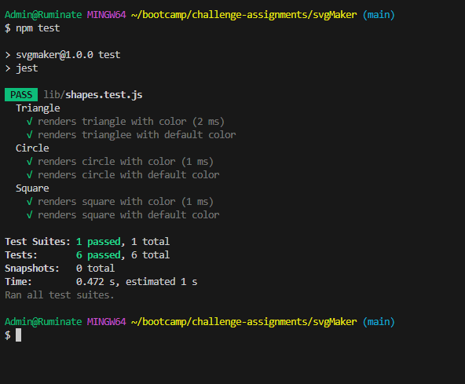

# svgMaker

# Description

The purpose of this application was to build a Node.js command line app that takes user input to generate a logo & save it as an SVG file. This app did not require deployment, so a walkthrough video was provided to demonstrate the functionality of the app, and show that all tests pass. App is using Jest for running tests and Inquirer for collecting user input.

# Installation

User should "npm i" to ensure dependencies are installed.

# Usage

Please run "node index.js" in terminal, user will be prompted to answer questions about their logo. What they would like to write, what color the text should be, what shape the logo should be, and what color the shape should be. Once all questions are answered the terminal will show a message saying the SVG file was generated. A file titled "logo.svg" will be created and once opened in browser, it should match user input.

# Testing

To run the tests, user can run command "npm test" in the terminal. Jest will run the tests and show whether they passed or failed. 

# [Walkthrough Video](https://drive.google.com/file/d/1ODWQEjsdvTeooINiTK_Rv1PSfkciwirY/view)